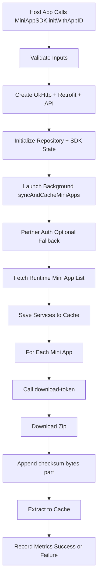
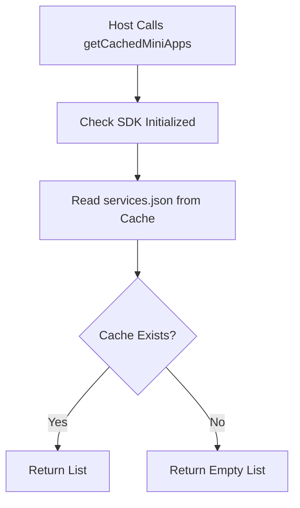
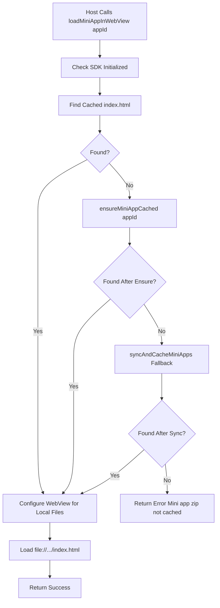
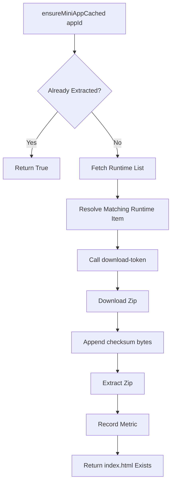
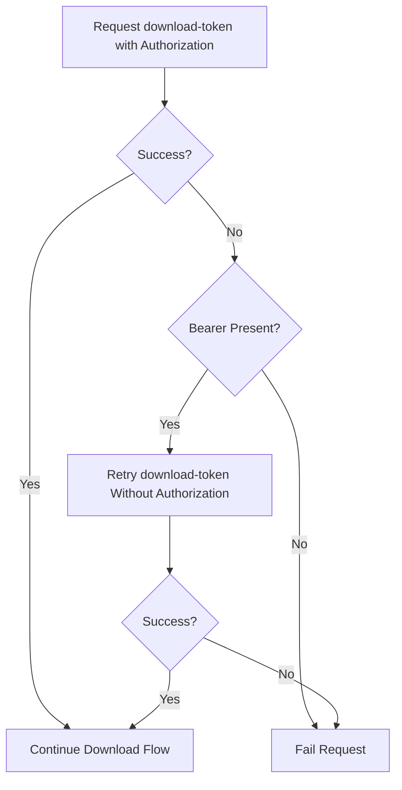

# MiniApp Android SDK Flows

This document captures end-to-end runtime flows for the Android SDK.

## 1) SDK Initialization and Background Sync

## 2) Cached Mini App List Read

## 3) Mini App Click and WebView Load

## 4) Per-MiniApp Cache Creation

## 5) Download Token Fallback Behavior

