# MiniApp Android SDK Flows

This document captures end-to-end runtime flows for the Android SDK.

## 0) Final E2E Flow (Authoritative)

```mermaid
flowchart TD

User[User Opens SuperApp]

User --> Init[Host App calls initMiniAppSDK with appId, secretKey, domainURL]

Init --> AuthCheck{Is Partner Auth Enabled?}

AuthCheck -->|Yes| AuthAPI[Call /miniapp/v1/partner/auth]
AuthCheck -->|No| FirstInit

AuthAPI --> AuthResponse[Receive token + updatedDate]
AuthResponse --> FirstInit

FirstInit{Is First SDK Initialization?}

FirstInit -->|Yes| FetchMiniApps
FirstInit -->|No| CacheCheck

FetchMiniApps[Call fetchMiniApps API]

FetchMiniApps --> StoreCache[Store MiniApps List in Encrypted SDK Cache]

StoreCache --> VersionCheck

CacheCheck{Does cached updatedDate match auth updatedDate?}

CacheCheck -->|Yes| LoadCache
CacheCheck -->|No| FetchMiniApps

LoadCache[Load MiniApps from Cache]

LoadCache --> VersionCheck

VersionCheck{latestVersion OR bridgeVersion changed?}

VersionCheck -->|No| SkipDownload
VersionCheck -->|Yes| StartDownload

SkipDownload[Use Cached ZIP]

StartDownload --> EventStart

EventStart[Capture Event: ZipDownloadInitiated]

EventStart --> DownloadZip

DownloadZip[Download ZIP with Resume Support]

DownloadZip --> ResumeCheck{Download Complete?}

ResumeCheck -->|No| ResumeDownload
ResumeCheck -->|Corrupted| RestartDownload
ResumeCheck -->|Yes| VerifyManifest

ResumeDownload[Resume Download]

RestartDownload[Restart Download]

VerifyManifest[Verify Manifest]

VerifyManifest --> ManifestValid{Manifest Valid?}

ManifestValid -->|Yes| ExtractZip
ManifestValid -->|No| ManifestFail

ManifestFail[Capture Event: ManifestVerifyFailed]

ExtractZip --> ExtractSuccess{Extraction Successful?}

ExtractSuccess -->|Yes| ExtractDone
ExtractSuccess -->|No| ExtractFail

ExtractDone[Capture Events:\nZipDownloadCompleted\nManifestVerified\nZipExtracted]

ExtractFail[Capture Event: ZipExtractFailed]

SkipDownload --> MiniAppList
ExtractDone --> MiniAppList

MiniAppList[SDK Returns MiniApps List]

MiniAppList --> UIChoice

UIChoice{UI Type}

UIChoice -->|Custom UI| HostUI
UIChoice -->|Default UI| DefaultUI

HostUI --> TapMiniApp
DefaultUI --> TapMiniApp

TapMiniApp[User Taps Mini App]

TapMiniApp --> OpenMiniApp[Host App Calls openMiniApp]

OpenMiniApp --> DownloadCheck{ZIP Already Downloaded?}

DownloadCheck -->|No| DownloadStatus
DownloadCheck -->|Yes| PermissionCheck

DownloadStatus[Return Download In Progress]

PermissionCheck[Check Required Permissions\ncamera, location, storage]

PermissionCheck --> PermissionGrantedCheck{Permissions Already Granted?}

PermissionGrantedCheck -->|Yes| LaunchMiniApp
PermissionGrantedCheck -->|No| RequestPermission

RequestPermission[Show System Permission Dialog]

RequestPermission --> PermissionResult{User Decision}

PermissionResult -->|Granted| GrantEvent
PermissionResult -->|Denied| DenyEvent

GrantEvent[Capture Event: PermissionGranted]

DenyEvent[Capture Event: PermissionDenied]

GrantEvent --> LaunchMiniApp
DenyEvent --> StopLaunch

StopLaunch[Return Permission Error]

LaunchMiniApp[Open Mini App in Fullscreen Container]

LaunchMiniApp --> SessionTokenCall

SessionTokenCall[Call runtime session token API]

SessionTokenCall --> SessionTokenValid{Session token valid?}

SessionTokenValid -->|Yes| BridgeConnect
SessionTokenValid -->|No| StopLaunch

BridgeConnect[Establish Bridge Communication]

BridgeConnect --> LaunchEvent

LaunchEvent[Capture Events:\nAppLaunched\nBridgeConnected]

LaunchEvent --> Running

Running[Mini App Running Like Separate App]

Running --> CloseMiniApp

CloseMiniApp[User Closes Mini App]

CloseMiniApp --> CloseEvents

CloseEvents[Capture Events:\nAppClosed\nBridgeDisconnected]
```

Session token endpoint used in the flow: `POST /miniapp/v1/runtime/{appId}/session-token`.
